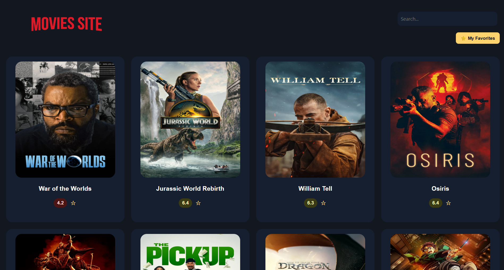
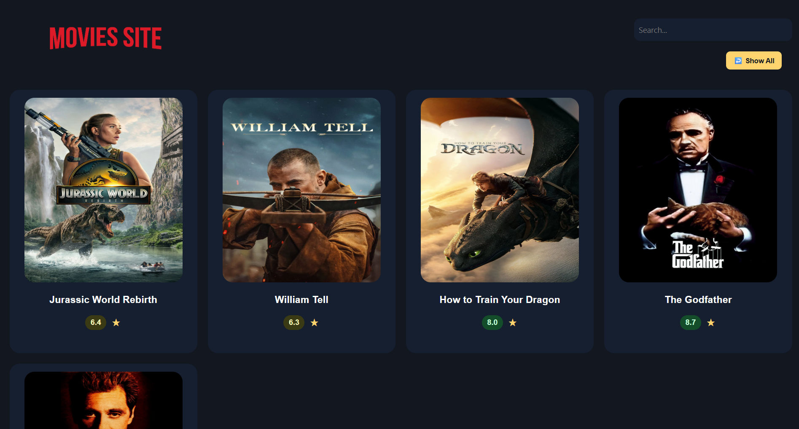
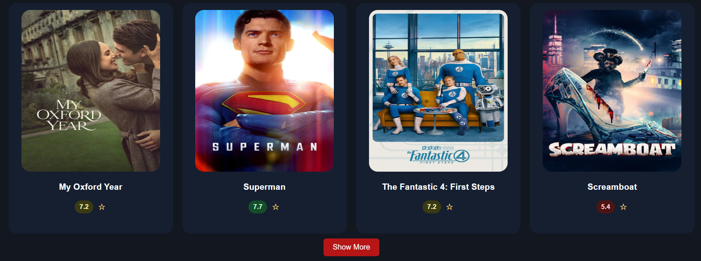
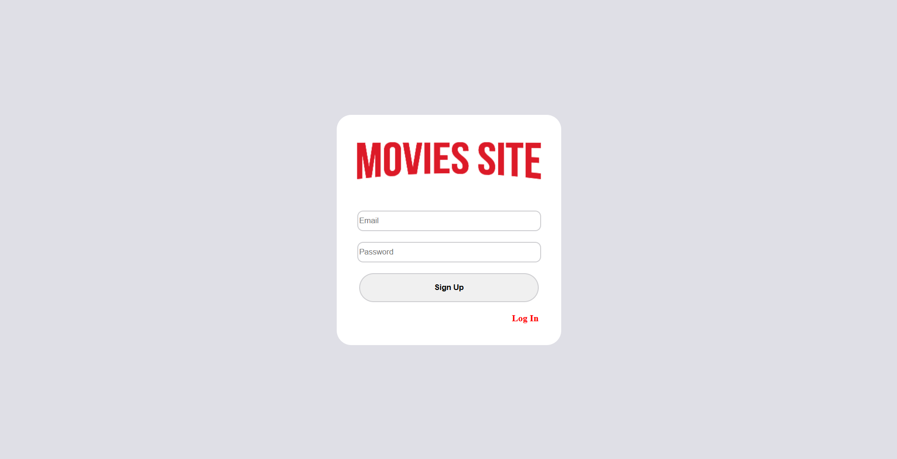

## Screenshots  

###  Homepage  
  

### ⭐ Favorites Page  
  

###  Show More Movies  
  

###  Login Page  
  

###  Sign Up Page  
  


#  Movie Site

A simple and elegant movie browsing app built with HTML, CSS, and JavaScript, leveraging the TMDb API for rich movie data.

---

##  Overview

Browse trending movies, search by title, mark your favorite films, and view details—all from a sleek, responsive interface.  
Now also includes a **Login & Sign Up system** to manage user sessions and favorites per user.

---

##  Features

-  View popular movies with infinite scrolling or "Show More" pagination  
-  Search for movies by title  
-  Add / remove movies from favorites (persisted in localStorage, per user)  
-  **User Authentication**: Sign Up & Log In forms (stored in localStorage for demo)  
-  Log Out button (clears session and redirects to login page)  
-  View movie details in a modal  
-  Responsive layout for desktop and mobile  
-  Notifications for adding/removing favorites  

---

##  Tech Stack

- HTML5  
- CSS3 (with Flexbox/Grid)  
- Vanilla JavaScript  
- [TMDb API](https://www.themoviedb.org/documentation/api)

---

##  Installation

1. Clone the repo:
   ```bash
   git clone https://github.com/beyzasakaryaa/Movies-Site.git


##  About the Developer

**Beyza Sakarya** | [@beyzasakaryaa](https://github.com/beyzasakaryaa)  
Student at Üsküdar Üniversitesi — Istanbul  

Connect with me:  
- [LinkedIn](https://www.linkedin.com/in/beyzasakaryaa)  
- [Twitter](https://twitter.com/beyzasakarya20)  
- [Instagram](https://www.instagram.com/beyzasakaryaa)